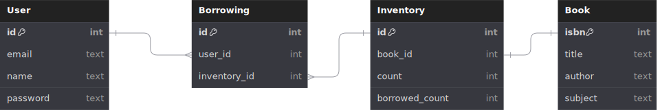

# Library API

simple api to borrow and return books in fastapi

### Installation
1. Make sure you have [poetry](https://python-poetry.org/) is installed in your system.
2. Execute the following command. This will create a virtual environment and install the packages.
```bash
poetry install
```

### Run migrations
1. Make sure proper environment variables are set. Check out .env-example for the list of all the environment variables.
2. Execute the following command. This will apply the database migrations.
```bash
alembic upgrade head
```

### Starting the development server
1. To run the server execute the following command.
```bash
fastapi dev main.py
```
2. By default the server runs at http://localhost:8000
3. open http://localhost:8000/docs for swagger documentation

### Starting the server with docker
1. Build the docker image
```bash
docker build -t library:latest .
```
2. Run the docker image
```bash
docker run -p 8000:8000 --env-file .env-example library
```

## Project Structure

### Database


1. User table is used to keep track of user data
2. Borrowing table is used to keep track of all the books that have been issued.
3. Inventory table is used to keep track of total available and borrowed count of a particular book.
4. Book table is used to keep track of book details


### Modules
- `images` - contains the readme file images
- `migrations` - contains the database migrations
- `models` - contains database models defined using sqlalchemy
- `routers` - contains the routing logic for all the apis
- `schemas` - contains pydantic models for serializing and deserializing data
- `services` - contains business logic
- `tests` - contains tests